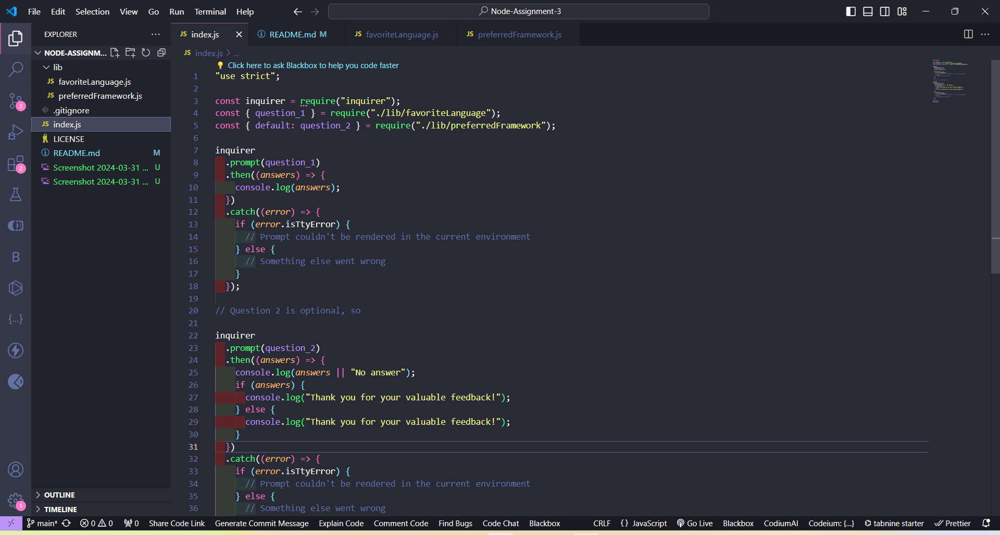

# Node-Assignment-3

## Survey Questions

I created a survey with node modules. Each question has a node module with javascript. This survey includes the following questions for each node module for User Input and Display Results.

## Question

1. What is your favorite programming language?

This is the first question.

2. what is your favorite preferred framework?

This is the second question, which asks for the preferred framework.

## Index file

The index file was created to display the responses from the survey questions on the node.

Here is my index file, with the following information:

In this image you can see that I have the following information about the responses from the survey questions.
